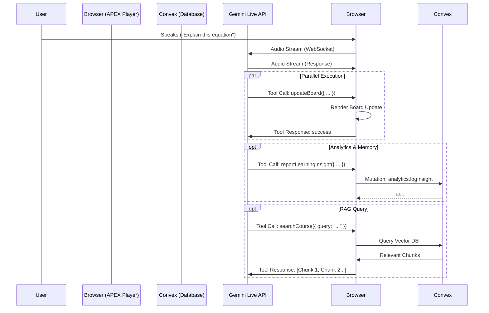

# Gemini Live API Implementation Guide

> **Status**: Future Enhancement
> **Priority**: Phase 2 (Live Teaching Pivot)
> **Model**: `gemini-2.5-flash-native-audio-preview-12-2025`

---

## Overview

We are pivoting from a pre-scripted "Text -> TTS" model to a fully dynamic, "Zoom-like" live teaching experience using the **Gemini Live API**. This allows the AI to see, hear, and interact with the student in real-time while controlling the **APEX Player** board.

## Architecture

The system moves from a linear playback model to a **Client-Driven Tool Execution** model.



## Tool Definitions

To make the system "resilient and strong", we define a strict set of tools that Gemini can use to manipulate the environment and track progress.

### 1. `updateBoard`
Controls the whiteboard visuals. This maps to `renderer.processBoardAction()`.

```typescript
{
  "name": "updateBoard",
  "description": "Updates the whiteboard with text, equations, diagrams, or shapes.",
  "parameters": {
    "type": "object",
    "properties": {
      "clear": { "type": "boolean", "description": "Whether to clear the board first" },
      "zone": { "type": "string", "enum": ["left", "center", "right", "full"] },
      "elements": {
        "type": "array",
        "description": "List of elements to add/update",
        "items": {
          "type": "object",
          "properties": {
             "id": { "type": "string" },
             "type": { "type": "string", "enum": ["text", "equation", "shape", "diagram", "code"] },
             "position": { "type": "object", "properties": { "x": {"type": "number"}, "y": {"type": "number"} } },
             "content": { "type": "object" }, // Typed based on 'type'
             "style": { "type": "object" }
          }
        }
      }
    }
  }
}
```

### 2. `triggerCheckpoint`
Pauses the lesson to ask a formal question (modal overlay).

```typescript
{
  "name": "triggerCheckpoint",
  "description": "Pauses the lesson to ask the student a multiple-choice or open-ended question.",
  "parameters": {
    "type": "object",
    "properties": {
      "prompt": { "type": "string" },
      "correctAnswer": { "type": "string" },
      "options": { "type": "array", "items": { "type": "string" } },
      "xpReward": { "type": "number" }
    }
  }
}
```

### 3. `reportLearningInsight`
**NEW**: Allows the AI to "take notes" on the student's performance, confusion, or engagement. This data feeds into the long-term memory and analytics dashboard.

```typescript
{
  "name": "reportLearningInsight",
  "description": "Logs an observation about the student's current learning state. Call this when the student shows confusion, mastery, or strong emotion.",
  "parameters": {
    "type": "object",
    "properties": {
      "type": { "type": "string", "enum": ["confusion", "mastery", "engagement", "frustration", "curiosity"] },
      "confidence": { "type": "number", "description": "0.0 to 1.0 (Student's perceived confidence)" },
      "topic": { "type": "string", "description": "The specific concept being discussed" },
      "observation": { "type": "string", "description": "Brief note: 'Student struggled with chain rule'" }
    },
    "required": ["type", "topic", "observation"]
  }
}
```

### 4. `searchCourseMaterial`
Allows the model to "remember" or "look up" facts from the huge course content (RAG).

```typescript
{
  "name": "searchCourseMaterial",
  "description": "Searches the course's uploaded documents for relevant information.",
  "parameters": {
    "type": "object",
    "properties": {
      "query": { "type": "string", "description": "The search query (e.g., 'What is mitochondria?')" }
    }
  }
}
```

## Implementation Plan

### Phase 1: The `GeminiBoardController`
We need a bridge between the WebSocket messages and the `APEXPlayer`.

**File**: `lib/apex/live-controller.ts` (New)

```typescript
export class GeminiBoardController {
  private player: APEXPlayer;

  constructor(player: APEXPlayer) {
    this.player = player;
  }

  async handleToolCall(toolCall: any) {
    switch (toolCall.name) {
      case 'updateBoard':
        this.player.executeBoardAction(toolCall.args);
        return { status: 'success' };

      case 'triggerCheckpoint':
         this.player.showCheckpoint(toolCall.args);
         return { status: 'pending_user_input' }; // Web socket might pause here

      case 'reportLearningInsight':
        // Fire-and-forget mutation
        await convex.mutation(api.analytics.logInsight, {
          sessionId: this.player.sessionId,
          ...toolCall.args
        });
        return { status: 'logged' };

      case 'searchCourseMaterial':
        return await convex.query(api.aml.search, { query: toolCall.args.query });
    }
  }
}
```

### Phase 2: Schema & Backend Updates
We need a new table to store these insights for "Long-Term Student retention".

**File**: `convex/schema.ts`
```typescript
// Add this new table
insights: defineTable({
    sessionId: v.id("sessions"),
    courseId: v.id("courses"),
    type: v.string(), // 'confusion', 'mastery', etc.
    topic: v.string(),
    confidence: v.optional(v.number()),
    observation: v.string(),
    timestamp: v.number(),
}).index("by_session", ["sessionId"])
  .index("by_course_type", ["courseId", "type"]), // For "Where do students struggle most?"
```

**File**: `convex/analytics.ts` (New)
```typescript
export const logInsight = mutation({
  args: { sessionId: v.id("sessions"), type: v.string(), topic: v.string(), observation: v.string(), confidence: v.optional(v.number()) },
  handler: async (ctx, args) => {
    const session = await ctx.db.get(args.sessionId);
    if (!session) return;

    await ctx.db.insert("insights", {
        ...args,
        courseId: session.courseId,
        timestamp: Date.now(),
    });

    // Optional: Real-time alert if frustration is high?
  }
});
```

### Phase 3: Client Connection
Using `@google/genai` to manage the WebSocket and tool declarations.

```typescript
// convex/live.ts
const session = await client.connect({
  model: "gemini-2.5-flash-native-audio-preview-12-2025",
  tools: [tools.updateBoard, tools.triggerCheckpoint, tools.reportLearningInsight, tools.searchCourseMaterial],
  systemInstruction: `
    You are an expert AI tutor.
    1. Teach dynamically using the board.
    2. MONITOR the student's understanding.
    3. If they seem confused or make a mistake, use 'reportLearningInsight' to log it, then adapt your teaching.
    4. If they master a concept, log 'mastery'.
  `
});
```

## Resiliency & "Checking the System"

Currently, the `APEXPlayer` is designed for *linear* playback. For a robust Live API integration, we must handle:

1.  **State Drift**:
    *   *Issue*: Gemini thinks the board is empty, but it has leftover drawings from a previous sequence.
    *   *Fix*: Always send a `clear: true` or `clear: false` flag explicitly in `updateBoard`.
    *   *Advanced Fix*: Implement `getBoardSnapshot` tool so Gemini can "see" what's on the board if it gets confused.

2.  **Audio/Visual Sync**:
    *   *Issue*: Audio arrives faster than the `tool_use` message.
    *   *Fix*: The Live API sends messages in order. We must execute the board update *immediately* upon receipt. The 30-50ms latency is acceptable for a "drawing while speaking" effect.

3.  **Interrupt Handling**:
    *   *Issue*: Student interrupts while Gemini is drawing a complex diagram.
    *   *Fix*: Gemini natively handles audio interruptions (VAD). On the client, if we detect `interrupted` event, we should `renderer.stopAnimations()` immediately to stop drawing the "old" diagram.

4.  **Long-Term Memory Building**:
    *   *Idea*: By using `reportLearningInsight`, we build a "Student Profile" over time.
    *   *Future*: When starting a NEW session, we query appropriate `insights` from the past.
    *   *Prompt Injection*: "Student previously struggled with 'Calculus Chain Rule' (Confidence: 0.2). Review this first."

## Benefits
-   **True Interactivity**: The student can say "Wait, draw that triangle again but bigger", and Gemini can actually do it (via a new tool call).
-   **Data-Driven Customization**: We capture *qualitative* data (confusion, mastery) that simple quiz scores miss.
-   **Simplified Backend**: We remove the complex `convex/aml.ts` generation logic and move to a creative, real-time intelligence model.

## Next Steps
1.  Implement `executeBoardAction` in `APEXPlayer`.
2.  Create `GeminiBoardController` class.
3.  Set up the WebSocket endpoint in Convex/Client.
